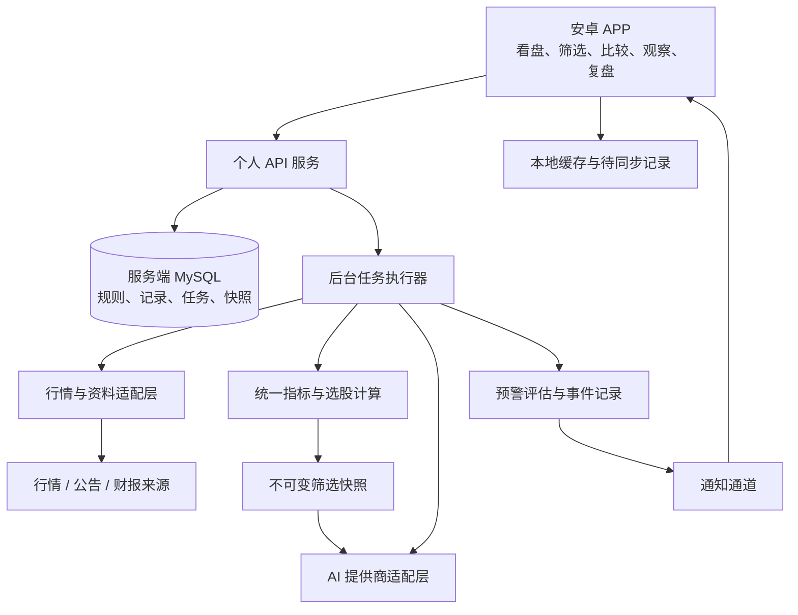

> 历史方案：2026-09-12 已改为 H5；当前实施以 [H5 迁移记录](h5-migration.md) 和根 README 为准，本文原生安卓部分停止执行。

# 观澜：技术方案初稿

状态：设计稿归档；正式实现采用 Kotlin/Compose 与现有 NestJS/MySQL，当前差异及边界见[部署说明](../../tuanzi-server-base/docs/plans/2026-09-12-guanlan-runbook.md)。更新：2026-09-12。

下文的完整离线缓存/冲突同步、厂商推送、公告财报、自动引用校验与回测评估是设计方向，当前实现尚不包含。实际代码和验证记录优先于早期建议。

后端当前权威接入方案：[NestJS 仓库接入设计](../../tuanzi-server-base/docs/plans/2026-09-12-guanlan-integration-design.md)。
需求依据：[第一版需求草案](product-scope.md)。实施顺序：[阶段计划](delivery-plan.md)。

现有 React / Capacitor / Node 试写代码产生于方案讨论前，暂存供参考，不是技术决策依据，不代表产品已实现。

## 1. 建议方案

安卓客户端建议采用 **Kotlin + Jetpack Compose**；用户已指定复用 **tuanzi-server-base（NestJS + TypeORM + MySQL）** 作为后端，复用登录与 AI 会话基础。指标和筛选由服务端统一计算，安卓负责图表交互、本地缓存、记录编辑和通知呈现。

这是基于“当前只需要安卓、需要长期使用”的工程判断，不是已获确认的选择。Android 官方推荐 Compose 作为现代 UI 工具，并建议划分 UI 与数据层；本方案遵循这一方向。[Android 架构建议](https://developer.android.com/topic/architecture/recommendations)

| 方案 | 对本项目的好处 | 需要承担的工作 | 本轮判断 |
| --- | --- | --- | --- |
| Kotlin + Compose | 直接使用安卓通知、存储和生命周期能力，适合安卓专用产品 | 需要配置安卓工具链；K 线手势、图表库仍需验证 | 推荐为正式客户端候选 |
| Flutter | 可以兼顾未来 iOS，具有跨平台 UI 与原生互操作机制 | 引入 Dart；图表与推送插件仍需设备验证 | 如果明确计划 iOS，再提高优先级 |
| React + Capacitor | 可使用 Web 技术并调用原生能力，便于复用浏览器原型 | 图表触控、WebView 和通知桥接需额外验证 | 适合原型或明确希望复用 Web 的情况 |

Flutter 和 Capacitor 的能力依据分别见 [Flutter 架构概述](https://docs.flutter.dev/resources/architectural-overview)、[Capacitor 文档](https://capacitorjs.com/docs)。表中适合程度是项目判断，尚未进行性能对比测试。浏览器交互原型可独立制作，不要求正式 APP 使用相同技术栈。

后端工作分支为 `feat/guanlan-stock-app`。当前本机已检查到 Node.js 可用，Java 运行时和 Android SDK 尚未就绪。实施时单独安排工具链搭建，不因本机已装什么而决定产品架构。

## 2. 总体架构

单用户第一版采用单体服务和一个任务执行器，服务端 MySQL 为个人数据主存储，安卓本地数据库保留缓存和待同步记录。数据量与任务并发证明确有需要时再考虑 PostgreSQL 或队列服务，不先引入微服务。

行情、筛选、分析和预警共用标准数据口径。客户端不再维护另一套指标算法。离线可查看已下载的图表与报告、编辑复盘；新行情、全市场筛选及 AI 分析需要联网。离线记录使用唯一 ID 和版本同步，遇到双方修改时保留冲突副本供选择。Android 的离线优先设计资料支持本地数据源、持久队列与重连协调的设计方向。[离线优先应用](https://developer.android.com/topic/architecture/data-layer/offline-first)

## 3. 行情数据

候选接入：用 AKShare 验证数据覆盖，TuShare 或有授权的行情服务作为替代候选。正式选择以接口实测、实际权限、可用预算为准，不能把采集库等同于有服务保障的实时行情源。详细依据见 [接口与平台核验记录](technical-evidence.md)。

标准化字段至少包含股票代码与交易所、数据来源、交易日、行情时间（来源提供时）、抓取时间、周期、复权模式、是否收盘、数据质量状态。来源未提供行情时间时留空，不能把抓取时间伪装成报价时间。

- 实时报价、分时、历史 K 线分别接入，日 K 不能替代分时。
- 行情批量抓取、缓存、限流；历史 K 线增量更新；失败保留旧数据并标记过期。
- 交易时段、午休、节假日由交易日历和时区驱动；停牌与缺失数据不填成零。
- 复权变动需更新相关历史窗口与指标；保存分析当时的数据快照，防止后来复权改变历史报告。
- 同一批筛选固定数据截止点，避免半数股票使用昨天、半数使用今天。
- 第一条流程先跑自选池；全市场收盘筛选在缓存与覆盖检查完成后开放。

行情刷新目标、分钟历史覆盖及可取得的财报和公告，均留待数据验证阶段确认。

## 4. 指标与筛选

内置 MA、MACD、KDJ、RSI、BOLL。拟用参数为 MA 多周期、MACD 12/26/9、KDJ 9/3/3、RSI 6/12/24、BOLL 20/2；这些是初始产品默认值建议，可修改，不宣称与其他软件天然一致。

计算规范须写清楚 EMA 初值、预热长度、KDJ 平滑算法及最高最低相同时的处理、RSI 平滑与零分母处理、BOLL 标准差口径，以及 MACD 柱值是否乘 2。不同软件差异通过样本比对记录，不用名称相同代替结果一致。

- 交叉条件使用相邻两个有效点，例如前一点不高于、当前点高于；首次可计算点不能凭空判定金叉。
- 样本不足返回“数据不足”，不得当作 0 或不符合条件静默处理。
- 默认指标筛选使用已收盘 K 线；盘中临时信号单独标记，不能描述为已确认信号。
- 筛选结果保存规则版本、参数、股票范围、数据截止时间、复权口径、命中值、被排除或未计算原因。
- 同批所有候选使用相同计算版本。修改参数后生成新结果，不覆盖原记录。

自定义公式引擎本版不做；仅保持内置指标注册接口清楚，不预先实现解释器。

## 5. AI 二次分析

流程：选择候选股 → 固定筛选快照 → 补充确实取得的证据 → 分批分析 → 按相同比较维度汇总 → 用户选择观察对象。

AI 不承担指标数值计算，也不自行构造未获取的行情。输入包括筛选目的、命中规则及数值、同一截止点的量价数据、可获取的公告/财报及用户备注。提供商通过后端适配，不提前锁定 Ollama 或某家云模型。

输出建议固定为：

| 内容 | 展示要求 |
| --- | --- |
| 筛选逻辑匹配程度 | 引用命中的条件及证据编号 |
| 支持与削弱因素 | 分开陈述已知事实和模型推断 |
| 横向比较 | 在同批候选和同一维度内比较；支持并列或暂不判断 |
| 优先观察理由 | 给出具体原因，不只有综合分数 |
| 待验证条件 | 可人工转为观察项；转为预警前确认数值和周期 |
| 数据覆盖 | 未接入的信息、数据时间、模型与提示模板版本 |

没有新闻或财报不能生成“无负面消息”或“基本面良好”的结论。引用必须能回到实际取得的资料；结构和引用校验不通过时保留错误状态、允许重试。外部文本作为待分析数据处理，不能指挥工具操作。报告以不可信文本安全渲染。

分析任务可取消、失败重试、查看进度。按输入快照、模型和模板版本缓存；用户明确发起才产生新的模型调用。批量上限、预算上限及超限提示在提供商确定后设置；第一版不默认让每条价格跳动都触发 AI。

报告保存生成时间与数据截止时间。后续表现只能衡量当时保存的候选，不能事后用新数据重写当时结论。

## 6. 预警与安卓通知

必须区分 **行情条件命中、产生预警事件、消息发送、设备收到**，四者不是同一状态。

| 运行方式 | 能力边界 | 适用前提 |
| --- | --- | --- |
| APP 打开时检查 | 检查当前获取到的行情并展示提醒 | 用户接受关闭后暂停 |
| 服务端持续检查 + 安卓推送 | APP 不在前台时，服务器仍可评估条件 | 有长期在线服务、可用行情源和选定的推送通道 |

若要求关闭 APP 后继续预警，推荐第二种。WorkManager 不作为秒级或分钟级盯盘引擎；其调度与设备限制见核验记录。国内安卓的具体推送渠道需结合手机品牌、网络及第三方接入条件实测，不提前假定 FCM 可覆盖用户设备。

规则语义：首次由“不满足”变为“满足”时产生事件；持续满足不重复发送；恢复不满足后重新布防，并遵守冷却时间。新建或重启时已满足如何处理要有明确设置，默认记录一次当前命中并标注非新穿越。指标交叉按 K 线唯一标识去重。

事件与规则状态持久化；任务重试不能制造重复事件。无效、过期、演示行情不进入真实预警。缺失数据保留“未知”，不能当作恢复并重新布防。离线期间已经过时的事件标记历史，不冒充刚发生。

## 7. 策略保存、复盘和 AI 对话（V2 更新）

用户选择深色方案并认可首页。选股分为固定指标策略与自定义组合策略：固定模板只读，复制后编辑；自定义策略保存唯一 ID、名称、版本、指标参数、条件关系、周期、复权与股票范围。修改生成新版本，过去筛选快照引用原版本；删除策略不删除过去报告。自定义公式仍延期。

复盘改为大盘与个股，不做成交录入、交易核算或持仓管理。大盘回顾指数、量能、市场宽度与板块；个股回顾走势、量价与指标信号。各字段仅在取得数据后展示，未取得必须说明。复盘绑定对象、日期、快照与笔记；可把当前复盘作为 AI 对话上下文。

AI 对话与复盘合并为统一工作区，复盘以任务会话呈现。会话保存消息顺序、对象、关联筛选或复盘快照、数据截止时间、模型版本与引用。切换讨论对象只影响后续消息，已有消息保留其原上下文。支持新会话、连续追问、取消生成、失败重试及历史读取；这些正式能力需要单独验收，当前原型使用预写回复并将会话保存在本机浏览器，支持新建、打开、续聊、确认删除。

正式数据仍采用服务端主存储与本地缓存/离线待同步记录，私有 AI 凭据保留服务端。原型的自定义策略存于带 PROTOTYPE 标记的 localStorage 键，仅为检验保存与复用，不代表正式存储选型；观察仍为内存演示；对话及会话中的复盘保存在带 PROTOTYPE 标记的独立本机存储键，不保证跨设备同步。

## 8. 部署与个人访问

- 正式安卓包连接手机可访问的 HTTPS 服务，不硬编码开发电脑 localhost。
- 个人访问凭据首次配对配置，妥善存储；不把 AI API 密钥放进 APK 或前端构建变量。
- 后端统一管理行情与 AI 凭据、调用额度和错误日志；日志避免包含凭据及完整私人笔记。
- 单用户也需要数据库备份与恢复演练。数据与演示环境分离。
- 部署位置、域名、推送账号和付费服务未确认；这不阻塞交互原型，阻塞正式的后台预警验收。

## 9. 验证标准

1. 指标：固定数据集覆盖初值、样本不足、平盘、停牌、复权变动和交叉边界；记录与参考计算的容差及差异解释。
2. 数据：实测交易日及非交易日，检查时间戳、缺失、限流和失败状态；不以一次成功视为长期稳定。
3. AI：使用相同候选与证据评测事实引用、信息缺口、比较一致性和错误处理；模型升级记录变化。
4. 预警：模拟重复调度、网络失败、恢复、跨交易日、设备后台与权限关闭；分别验收事件生成和送达。
5. 策略与复盘：验证策略保存/编辑/复用、原版本快照不被覆盖、复盘对象与日期匹配、笔记和对话备份恢复。
6. 安卓：真机验证 K 线拖动缩放、前后台切换、离线重启、字体放大和通知点击跳转。
7. 业务价值：保留“指标候选池”与“AI 优先观察子集”，在相同时间窗口跟踪，纳入未选股票并记录数据缺失；没有足够样本前不宣称 AI 提升收益。交易成本和基准由评估方案显式约定。

## 10. 需要在原型前后确认的决策

原型前先评审主流程及正式客户端候选；不要求用户选库版本。原型里重点验证：筛选条件是否好理解、AI 比较是否有助取舍、报告能否回到原始依据、观察与预警是否容易设置。

数据供应商、推送渠道与 AI 提供商在各自实测与需求明确后定稿。未经这些验证，技术方案只代表设计方向。
